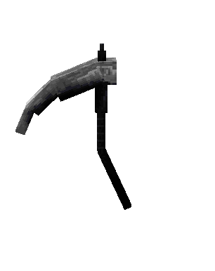
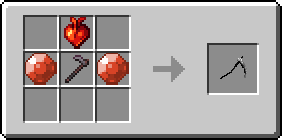
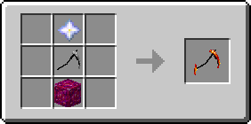
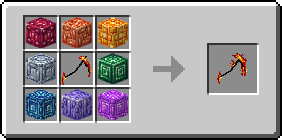

# 🗡 Пылающая Коса


На данный момент для этого предмета доступны не все материалы, которые участвуют в крафте, однако сейчас вы можете начать собирать некоторые из них для ускорения процесса в будущем&#x20;


Часть [комплекта Пламени](../). Пылающая Коса может быть улучшена до [Сияющей Косы Пламени](./#siyayushaya-kosa-plameni).

<figure><figcaption>
Четыре стадии эволюции косы
</figcaption></figure>

## Характеристики

* 9 Урон
* 1.6 **** Скорость атаки
* Неразрушаемый
* Не может быть уничтожено в огне, лаве, молнией, об кактус

## Особенности и ограничения

| Работает в _**PvP**_                 | :white\_check\_mark: |
| ------------------------------------ | -------------------- |
| Работает в _**PvE**_                 | :white\_check\_mark: |
| Работает в _**Верхнем мире**_        | :white\_check\_mark: |
| Работает в _**Нижнем мире**_         | :white\_check\_mark: |
| Работает в _**мире Края**_           | :white\_check\_mark: |
| Работает на _**боссах**_             | :white\_check\_mark: |
| Совместимо с _**кастомными чарами**_ | :white\_check\_mark: |

## Способности

* _**Пассивная**_** – Иммунитет к огню**: \
  Невосприимчивость к урону от огня и лавы.


Для разблокировки _**Пассивной**_ способности необходимы четыре вещи типа брони из [комплекта Пламени](../)


* _**Базовая атака**_** – Пылающий Удар (ЛКМ)**: \
  Совершает рубящий  удар.\
  \
  :boom: 4 Урон\
  :red\_circle: 1 Радиус\
  :hourglass: 1 сек. Кулдаун\

* _**Навык 1**_** – Адское колесо (ПКМ)**: \
  Вращает свою косу и сжигает существ вокруг себя.\
  \
  :boom: 4 Урон\
  :fire: 4 сек. Урон от огня\
  :red\_circle: 4 Радиус\
  :hourglass: 2 сек. Кулдаун\


Для разблокировки _**Навыка 1**_ необходим __ [_Шлем Пламени_](../shlem-plameni.md)__


* _**Навык 2**_** – Пылающий прыжок (Shift + ПКМ)**: \
  Совершает прыжок вверх.\
  \
  :hourglass: 3 сек. Кулдаун


Для разблокировки _**Навыка 2**_ необходима [Кираса Пламени](../kirasa-plameni.md)


* _**Навык 3**_** – Адские сферы (Shift + Shift)**: \
  Создает вращающиеся огненные сферы, которые поджигают объекты при попадании.\
  \
  :boom: 5 Урон\
  :fire: 4 сек. Урон от огня\
  :red\_circle: 1 Радиус\
  :hourglass: 13 сек. Кулдаун


Для разблокировки _**Навыка 3**_ необходимы [Поножи Пламени](../ponozhi-plameni.md)


* _**Ультимейт-навык**_** – Коса адского пламени (Shift + ЛКМ)**:\
  Базовая атака _**Пылающий Удар**_ заменяется на _**Инфернальный удар**_. На 10 секунд скорость  передвижения и скорость атаки увеличиваются. Базовые атаки становятся больше и сильнее, сжигая сущности при атаке.\
  \
  :boom: 6 Урон\
  :fire: 4 сек. Урон от огня\
  :red\_circle: 1.5 Радиус\
  :hourglass: 20 сек. Кулдаун


Для разблокировки _**Ультимейт-навыка**_ необходимы [Кираса Пламени](../kirasa-plameni.md) и [Ботинки Пламени](../botinki-plameni.md)


* _**Комбо-навык**_** – Адский вихрь (Shift + ПКМ – ПКМ):**\
  ****Совершает прыжок вверх и начинает вращать свою косу, разбивая поверхность, вызывая взрыв.\
  \
  :boom: 4 Урон\
  :fire: 4 сек. Урон от огня\
  :red\_circle: 6 Радиус\
  :hourglass: 8 сек. Кулдаун


Для разблокировки _**Комбо-навыка**_ необходимы четыре вещи типа брони из [комплекта Пламени](../)


## Получение

#### _Крафт_

Крафт Пылающей Косы состоит из нескольких этапов.

#### Угасшая Коса

|                                                                                                                                   | Этап 1 (Угасшая Коса)                                                                             |
| --------------------------------------------------------------------------------------------------------------------------------- | ------------------------------------------------------------------------------------------------- |
| 
Незеритовая мотыга + <a href="broken-reference">Чистый камень огня</a> + <a href="broken-reference">Сердце Лилит</a>
 |  |

#### Тускло горящая Коса

|                                                                                                                                                              | Этап 2 (Тускло горящая Коса)                                                                      |
| ------------------------------------------------------------------------------------------------------------------------------------------------------------ | ------------------------------------------------------------------------------------------------- |
| 
<a href="./#ugasshaya-kosa">Угасшая Коса</a> + Звезда незера + <a href="../../../bloki/dragonitovyi-blok-1.md">Улучшенный драгонитовый блок</a>
 |  |

#### Пылающая Коса

|                                                                                                                                                                                                                                                                                                                                                                                                                                                                                                                                                                                                                                                                | Этап 3 (Пылающая Коса)                                                                            |
| -------------------------------------------------------------------------------------------------------------------------------------------------------------------------------------------------------------------------------------------------------------------------------------------------------------------------------------------------------------------------------------------------------------------------------------------------------------------------------------------------------------------------------------------------------------------------------------------------------------------------------------------------------------- | ------------------------------------------------------------------------------------------------- |
| 
<a href="./#tusklo-goryashaya-kosa">Тускло горящая Коса</a> +

<a href="../../../bloki/dragonitovyi-blok.md">Драгонитовый блок</a> + <a href="../../../bloki/topazovyi-blok.md">Топазный блок</a> + <a href="../../../bloki/citrinovyi-blok.md">Цитриновый блок</a> + <a href="../../../bloki/turmalinovyi-blok.md">Турмалиновый блок</a> + <a href="../../../bloki/kuncitovyi-blok.md">Кунцитовый блок</a> + <a href="../../../bloki/tanzanitovyi-blok.md">Танзанитовый блок</a> + <a href="../../../bloki/sapfirovyi-blok.md">Сапфировый блок</a> + <a href="../../../bloki/labradoritovyi-blok.md">Лабрадоритовый блок</a>
 |  |
