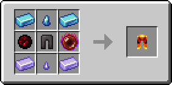

# 👖 Поножи Пламени

<figure><figcaption></figcaption></figure>

## Характеристики

\+6 Броня

\+3 Твёрдость брони

\+1 Сопротивление отбрасыванию

## Способности

Поножи Пламени при надевании разблокируют [_**Навык 3**_** – Адские сферы**](kosa-plameni/#sposobnosti) **для предмета** [**Пылающая Коса**](kosa-plameni/)****


_**Совет**_**:** начните с получения [Пылающей Косы](kosa-plameni/), после чего приобретайте другие сетовые предметы для разблокировки новых способностей


## Получение

#### _Крафт_

|                                                                                                                                                                                                                                                                                                                                                                                                                                                                                                                                                                               | Поножи Пламени                                                                             |
| ----------------------------------------------------------------------------------------------------------------------------------------------------------------------------------------------------------------------------------------------------------------------------------------------------------------------------------------------------------------------------------------------------------------------------------------------------------------------------------------------------------------------------------------------------------------------------- | ------------------------------------------------------------------------------------------ |
| 
<a href="../../materialy/metally-i-mineraly/sapfirovyi-slitok.md">Сапфировый слиток</a> + <a href="../../materialy/metally-i-mineraly/kusochek-sapfira.md">Кусочек сапфира</a> + <a href="../../materialy/amthirmis_lump.md">Кусок Амфирмиса</a> + Незеритовый нагрудник + <a href="../../materialy/blood_pearl_of_teleportation.md">Кровавая жемчужина</a> + <a href="../../materialy/metally-i-mineraly/tanzanitovyi-slitok.md">Танзанитовый слиток</a> + <a href="../../materialy/metally-i-mineraly/kusochek-tanzanita.md">Кусочек танзанита</a>
 |  |
