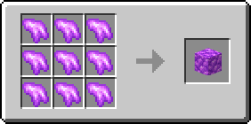

# 🎩 Шлем Пламени

<figure><figcaption></figcaption></figure>

## Характеристики

\+3 Броня

\+3 Твёрдость брони

\+1 Сопротивление отбрасыванию

## Способности

Шлем Пламени при надевании разблокирует [_**Навык 1**_** – Адское колесо**](kosa-plameni.md#sposobnosti) **для предмета** [**Пылающая Коса**](kosa-plameni.md)**.**

## Получение

#### _Крафт_

Крафт Шлема Пламени состоит из нескольких этапов.

|                                                                                | Этап 1                                                                                                  |
| ------------------------------------------------------------------------------ | ------------------------------------------------------------------------------------------------------- |
| 
<a href="shlem-plameni.md#kharakteristiki">item</a> + item + item
 |  |
