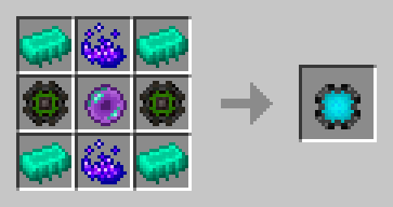
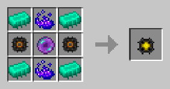

# Модуль памяти 7 ур.

<figure><figcaption></figcaption></figure>

## Получение

#### _Крафт_

|                                                                                                                                                                                                                               |  Модуль памяти 7 ур.                  |
| ----------------------------------------------------------------------------------------------------------------------------------------------------------------------------------------------------------------------------- | ------------------------------------- |
| 
<a href="purple_blaze.md">Фиолетовое пламя</a> + <a href="262144k_fluid.md">Модуль памяти 6 ур.</a> + <a href="spawner_seeker.md">Пространственное ядро</a> + <a href="enderite_ingot.md">Слиток эндерита</a>
 |  |

## Использование

#### _Как ингредиент при крафте_

#### [Модуль памяти 3 ур.](1024k.md)

|                                                                                                                                                                                                                              |  Модуль памяти 3 ур.                 |
| ---------------------------------------------------------------------------------------------------------------------------------------------------------------------------------------------------------------------------- | ------------------------------------ |
| 
<a href="purple_blaze.md">Фиолетовое пламя</a> + <a href="16384k_fluid.md">Модуль памяти 2 ур.</a> + <a href="spawner_seeker.md">Пространственное ядро</a> + <a href="enderite_ingot.md">Слиток эндерита</a>
 |  |

#### [Модуль памяти 8 ур.](1048576k_fluid.md)

|                                                                                                                                                                                                                        |  Модуль памяти 8 ур.                           |
| ---------------------------------------------------------------------------------------------------------------------------------------------------------------------------------------------------------------------- | ---------------------------------------------- |
| 
<a href="purple_blaze.md">Фиолетовое пламя</a> + <a href="16384k.md">Модуль памяти 7 ур.</a> + <a href="spawner_seeker.md">Пространственное ядро</a> + <a href="enderite_ingot.md">Слиток эндерита</a>
 |  |

