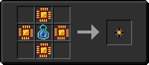

# Модуль памяти 1 ур.

<figure><figcaption></figcaption></figure>

## Получение

#### _Крафт_

|                                                                                                                    |  Модуль памяти 1 ур.                |
| ------------------------------------------------------------------------------------------------------------------ | ----------------------------------- |
| 
<a href="logic_processor.md">Логический процессор</a> + <a href="weak_arcana_potion.md">Зелье Арканы</a>
 |  |

## Использование

#### _Как ингредиент при крафте_

#### [Наполненное сердце](heart.md)

|                                                                                                                                                                        |  Наполненное сердце                  |
| ---------------------------------------------------------------------------------------------------------------------------------------------------------------------- | ------------------------------------ |
| 
<a href="item_storage_cell_256k.md">Хранилище элемента 5 ур.</a> + <a href="heart_empty.md">Пустое сердце</a> + <a href="fury_fire.md">Яростный огонь</a>
 |  |

#### [Данные настроек](settings_data.md)

|                                                                                                                                                                             |  Данные настроек                              |
| --------------------------------------------------------------------------------------------------------------------------------------------------------------------------- | --------------------------------------------- |
| 
<a href="purple_blaze.md">Фиолетовое пламя</a> + <a href="cell_component_256k.md">Компонент чувств 5 ур.</a> + <a href="enderite_ingot.md">Слиток эндерита</a>
 |  |

#### [Модуль памяти 2 ур.](16384k_fluid.md)

|                                                                                                                                                                                                                      |  Модуль памяти 2 ур.                         |
| -------------------------------------------------------------------------------------------------------------------------------------------------------------------------------------------------------------------- | -------------------------------------------- |
| 
<a href="purple_blaze.md">Фиолетовое пламя</a> + <a href="256k.md">Модуль памяти 1 ур.</a> + <a href="spawner_seeker.md">Пространственное ядро</a> + <a href="enderite_ingot.md">Слиток эндерита</a>
 |  |

