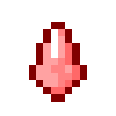

# Кислотная капля

<figure><figcaption></figcaption></figure>

## Получение

#### _Крафт_

|                                                                                                                                                                                                                                                                                                                                                           |  Кислотная капля                    |
| --------------------------------------------------------------------------------------------------------------------------------------------------------------------------------------------------------------------------------------------------------------------------------------------------------------------------------------------------------- | ----------------------------------- |
| 
<a href="gobber2_gooey_apple_nether..md">Адское зачарованное яблоко</a> + <a href="weak_arcana_potion..md">Зелье Арканы</a> + <a href="honeyed_apple..md">Адское медовое яблоко</a> + <a href="gobber2_gooey_bread_nether..md">Адский зачарованный хлеб</a> + <a href="gobber2_gooey_beef_nether..md">Адская зачарованная говядина</a>
 |  |

## Использование

#### _Как ингредиент при крафте_

#### [Коллектор](collector..md)

|                                                                                                           |  Коллектор                               |
| --------------------------------------------------------------------------------------------------------- | ---------------------------------------- |
| 
<a href="collector_fragments..md">Кусок коллектора</a> + <a href="acid..md">Кислотная капля</a>
 |  |

#### [Компонент пространственной ячейки 1 ур.](spatial_cell_component_2..md)

|                                                                                                                                                                       |  Компонент пространственной ячейки 1 ур.                   |
| --------------------------------------------------------------------------------------------------------------------------------------------------------------------- | ---------------------------------------------------------- |
| 
<a href="logic_processor..md">Логический процессор</a> + <a href="acid..md">Кислотная капля</a> + <a href="spawner_seeker..md">Пространственное ядро</a>
 |  |

#### [Компонент пространственной ячейки 2 ур.](spatial_cell_component_16..md)

|                                                                                                                                                                                                                                                           |  Компонент пространственной ячейки 2 ур.                    |
| --------------------------------------------------------------------------------------------------------------------------------------------------------------------------------------------------------------------------------------------------------- | ----------------------------------------------------------- |
| 
<a href="fireite_ingot..md">Огненный слиток</a> + <a href="acid..md">Кислотная капля</a> + <a href="dislocator_advanced..md">Ячейка пространства</a> + <a href="spatial_cell_component_2..md">Компонент пространственной ячейки 1 ур.</a>
 |  |

#### [Компонент пространственной ячейки 3 ур.](spatial_cell_component_128..md)

|                                                                                                                                                                                                                                                            |  Компонент пространственной ячейки 3 ур.                     |
| ---------------------------------------------------------------------------------------------------------------------------------------------------------------------------------------------------------------------------------------------------------- | ------------------------------------------------------------ |
| 
<a href="spatial_cell_component_16..md">Компонент пространственной ячейки 2 ур.</a> + <a href="acid..md">Кислотная капля</a> + <a href="dislocator_advanced..md">Ячейка пространства</a> + <a href="fireite_ingot..md">Огненный слиток</a>
 |  |

#### [Испорченная фея](corrupted_pixie..md)

|                                                                                                                  |  Испорченная фея                                |
| ---------------------------------------------------------------------------------------------------------------- | ----------------------------------------------- |
| 
<a href="acid..md">Кислотная капля</a> + <a href="dusk_arc..md">Сумеречная дуга</a> + Пузырёк опыта
 |  |

#### [Око Взора](watching_eye..md)

|                                                                                                                           |  Око Взора                                   |
| ------------------------------------------------------------------------------------------------------------------------- | -------------------------------------------- |
| 
<a href="spawner_seeker..md">Пространственное ядро</a> + <a href="acid..md">Кислотная капля</a> + Око Эндера
 |  |

#### [Конденсатор виверн](wyvern_capacitor..md)

|                                                                                                                                                                                                                                                                                                              |  Конденсатор виверн                              |
| ------------------------------------------------------------------------------------------------------------------------------------------------------------------------------------------------------------------------------------------------------------------------------------------------------------ | ------------------------------------------------ |
| 
<a href="acid..md">Кислотная капля</a> + <a href="watching_eye..md">Око Взора</a> + <a href="spatial_cell_component_128..md">Компонент пространственной ячейки 3 ур.</a> + <a href="obsidian_skull_shield..md">Обсидиановый череп</a> + <a href="corrupted_pixie..md">Испорченная фея</a>
 |  |

#### [Сердце элемента](item_life..md)

|                                                                                                 |  Сердце элемента                          |
| ----------------------------------------------------------------------------------------------- | ----------------------------------------- |
| 
<a href="dark..md">Тьма</a> + Сердце моря + <a href="acid..md">Кислотная капля</a>
 |  |

#### [Катализатор уничтожения](destruction_catalyst..md)

|                                                                                                                                                   |  Катализатор уничтожения                             |
| ------------------------------------------------------------------------------------------------------------------------------------------------- | ---------------------------------------------------- |
| 
<a href="dark..md">Тьма</a> + <a href="pure_element_holder..md">Элементальный держатель</a> + <a href="acid..md">Кислотная капля</a>
 |  |

#### [Энергетическое ядро дракона](draconic_energy_core..md)

|                                                                                                                                                                         |  Энергетическое ядро дракона                          |
| ----------------------------------------------------------------------------------------------------------------------------------------------------------------------- | ----------------------------------------------------- |
| 
Голова драконаЯйцо дракона<a href="draconic_core..md">Ядро дракона</a> + <a href="darkness..md">Эссенция тьмы</a> + <a href="acid..md">Кислотная капля</a>
 |  |

#### [Око наблюдателя](call_of_the_watcher..md)

|                                                                                                                                     |  Око наблюдателя                                      |
| ----------------------------------------------------------------------------------------------------------------------------------- | ----------------------------------------------------- |
| 
<a href="aquatic_dragon_scale..md">Совершенная чешуя дракона</a> + Око Эндера + <a href="acid..md">Кислотная капля</a>
 |  |

#### [Глаз циклопа](cyclops_eye..md)

|                                                                                                                   |  Глаз циклопа                               |
| ----------------------------------------------------------------------------------------------------------------- | ------------------------------------------- |
| 
<a href="fairy_ingot..md">Волшебный слиток</a> + Око Эндера + <a href="acid..md">Кислотная капля</a>
 |  |

#### [Компонент чувств 1 ур.](cell_component_1k..md)

|                                                                                                           |  Компонент чувств 1 ур.                            |
| --------------------------------------------------------------------------------------------------------- | -------------------------------------------------- |
| 
<a href="logic_processor..md">Логический процессор</a> + <a href="acid..md">Кислотная капля</a>
 |  |

#### [Легендарное око эндера](legendary_ender_eye..md)

|                                                                                                                     |  Легендарное око эндера                              |
| ------------------------------------------------------------------------------------------------------------------- | ---------------------------------------------------- |
| 
<a href="enderite_ingot..md">Слиток эндерита</a> + Око Эндера + <a href="acid..md">Кислотная капля</a>
 |  |

#### [Слиток эндерита](enderite_ingot..md)

|                                                                                                                      |  Слиток эндерита                               |
| -------------------------------------------------------------------------------------------------------------------- | ---------------------------------------------- |
| 
<a href="acid..md">Кислотная капля</a> + <a href="fireite_ingot..md">Огненный слиток</a> + Эндер-жемчуг
 |  |

#### [Плоть демона](demon_flesh..md)

|                                                                                                                                                                                                                                                                                  |  Плоть демона                               |
| -------------------------------------------------------------------------------------------------------------------------------------------------------------------------------------------------------------------------------------------------------------------------------- | ------------------------------------------- |
| 
<a href="forbidden_fruit..md">Запретный плод</a> + <a href="acid..md">Кислотная капля</a> + <a href="blood_pearl_of_teleportation..md">Кровавая жемчужина</a> + <a href="sweet_heart..md">Сердце Лилит</a> + <a href="eye_projectile..md">Око восхождения</a>
 |  |

#### [Шар восхождения](ascent_projectile..md)

|                                                                                            |  Шар восхождения                                  |
| ------------------------------------------------------------------------------------------ | ------------------------------------------------- |
| 
<a href="acid..md">Кислотная капля</a> + <a href="dislocator..md">Дислокатор</a>
 |  |

#### [Слиток Хана](red_aurum_ingot..md)

|                                                                                                                                                                                                                                                                                                                           |  Слиток Хана                                     |
| ------------------------------------------------------------------------------------------------------------------------------------------------------------------------------------------------------------------------------------------------------------------------------------------------------------------------- | ------------------------------------------------ |
| 
<a href="healing_stone..md">Исцеляющий камень</a> + <a href="ice_stone..md">Ледяной камень</a> + <a href="bluefire_stone..md">Камень синего огня</a> + <a href="bloodgem..md">Кровавый камень</a> + <a href="spawner_seeker..md">Пространственное ядро</a> + <a href="acid..md">Кислотная капля</a>
 |  |

