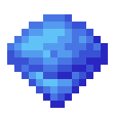
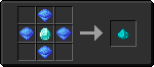

# Аквамарин

<figure><figcaption></figcaption></figure>

## Получение

#### _Крафт_

|                                                                                            |  Аквамарин                                |
| ------------------------------------------------------------------------------------------ | ----------------------------------------- |
| 
Лазурит<a href="aquatic_ingot.md">Водный слиток</a> + <a href="aqua.md">Аква</a>
 |  |

## Использование

#### _Как ингредиент при крафте_

#### [Зелье Арканы](weak_arcana_potion.md)

|                                                                                                                                                                                   |  Зелье Арканы                                       |
| --------------------------------------------------------------------------------------------------------------------------------------------------------------------------------- | --------------------------------------------------- |
| 
Пузырёк опыта<a href="blizz_rod.md">Стержень метели</a> + <a href="star_flare.md">Звездная вспышка</a> + Драконье дыхание + <a href="aquamarine.md">Аквамарин</a>
 |  |

#### [Очищенный кристалл маны](refained_mana_crystal2.md)

|                                                                                                                                                      |  Очищенный кристалл маны                                |
| ---------------------------------------------------------------------------------------------------------------------------------------------------- | ------------------------------------------------------- |
| 
<a href="perk_gem_sky.md">Драгоценный камень неба</a> + <a href="aquamarine.md">Аквамарин</a> + <a href="mana_pearl.md">Жемчуг маны</a>
 |  |

#### [Пыль желтого алмаза](medium.md)

|                                                         |  Пыль желтого алмаза                  |
| ------------------------------------------------------- | ------------------------------------- |
| 
<a href="aquamarine.md">Аквамарин</a> + Алмаз
 |  |

