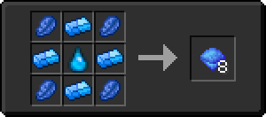

# Водный слиток

<figure><figcaption></figcaption></figure>

## Получение

#### _Крафт_

|                                                            |  Водный слиток                                |
| ---------------------------------------------------------- | --------------------------------------------- |
| 
Сгусток магмы<a href="aqua_ball.md">Водяной шар</a>
 |  |

## Использование

#### _Как ингредиент при крафте_

#### [Аквамарин](aquamarine.md)

|                                                                                            |  Аквамарин                                |
| ------------------------------------------------------------------------------------------ | ----------------------------------------- |
| 
Лазурит<a href="aquatic_ingot.md">Водный слиток</a> + <a href="aqua.md">Аква</a>
 |  |

