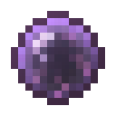

# Сфера крови архимага

<figure><figcaption></figcaption></figure>

## Получение

#### _Крафт_

|                                                                                                                                 |  Сфера крови архимага                           |
| ------------------------------------------------------------------------------------------------------------------------------- | ----------------------------------------------- |
| 
<a href="masterbloodorb.md">Кровавый шар мастера</a> + <a href="divining_rod_3.md">Великолепная волшебная палочка</a>
 |  |

## Использование

#### _Как ингредиент при крафте_

#### [Трансцендентный кровавый шар](transcendentbloodorb.md)

|                                                                                                                                   |  Трансцендентный кровавый шар                       |
| --------------------------------------------------------------------------------------------------------------------------------- | --------------------------------------------------- |
| 
<a href="archmagebloodorb.md">Сфера крови архимага</a> + <a href="divining_rod_3.md">Великолепная волшебная палочка</a>
 |  |

