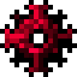

# Кусок Арксиана

<figure><figcaption></figcaption></figure>

## Получение

#### _Крафт_

|                                                                                                               |  Кусок Арксиана                               |
| ------------------------------------------------------------------------------------------------------------- | --------------------------------------------- |
| 
<a href="heliosis_lump.md">Кусок Гелиоса</a> + Алмаз + <a href="fury_fire.md">Яростный огонь</a>
 |  |

## Использование

#### _Как ингредиент при крафте_

#### [Ядро хаоса](chaotic_core.md)

|                                                                                                                                                                                                                          |  Ядро хаоса                                  |
| ------------------------------------------------------------------------------------------------------------------------------------------------------------------------------------------------------------------------ | -------------------------------------------- |
| 
<a href="arksiane_lump.md">Кусок Арксиана</a> + <a href="arksiane_disk.md">Диск Арксиана</a> + <a href="destruction_catalyst.md">Катализатор уничтожения</a> + <a href="cyclops_eye.md">Глаз циклопа</a>
 |  |

