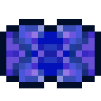
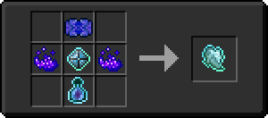

# Сердце Хейву

<figure><figcaption></figcaption></figure>

## Получение

#### _Крафт_

|                                                                                                                     |  Сердце Хейву                                           |
| ------------------------------------------------------------------------------------------------------------------- | ------------------------------------------------------- |
| 
Алмаз<a href="fireite_ingot.md">Огненный слиток</a> + <a href="xp_crystal_4.md">Кристалл опыта 5  ур.</a>
 |  |

## Использование

#### _Как ингредиент при крафте_

#### [Душа монстра](basemonstersoul.md)

|                                                                                                                                                                                                                                                             |  Душа монстра                                  |
| ----------------------------------------------------------------------------------------------------------------------------------------------------------------------------------------------------------------------------------------------------------- | ---------------------------------------------- |
| 
<a href="purple_blaze.md">Фиолетовое пламя</a> + <a href="band_of_heiva_hunting.md">Сердце Хейву</a> + <a href="sentientarmourgem_activated.md">Активированный камень разумной брони</a> + <a href="weak_arcana_potion.md">Зелье Арканы</a>
 |  |

