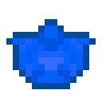

# Кусок синего алмаза

<figure><figcaption></figcaption></figure>

## Получение

#### _Крафт_

|                                                                                                                                                      |  Кусок синего алмаза                                |
| ---------------------------------------------------------------------------------------------------------------------------------------------------- | --------------------------------------------------- |
| 
<a href="high.md">Пыль синего алмаза</a> + <a href="weak_arcana_potion.md">Зелье Арканы</a> + <a href="fury_fire.md">Яростный огонь</a>
 |  |

## Использование

#### _Как ингредиент при крафте_

#### [Камень синего огня](bluefire_stone.md)

|                                                                                                                    |  Камень синего огня                            |
| ------------------------------------------------------------------------------------------------------------------ | ---------------------------------------------- |
| 
<a href="fireite_ingot.md">Огненный слиток</a> + <a href="blue_diamond_chunk.md">Кусок синего алмаза</a>
 |  |

