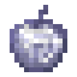
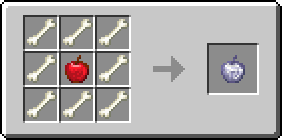

# Костное яблоко

<figure><figcaption></figcaption></figure>

## Получение

#### _Крафт_

|                     |  Костное яблоко                     |
| ------------------- | ----------------------------------- |
| 
Кость	Яблоко
 |  |

## Использование

#### _Как ингредиент при крафте_

#### [Запретный плод](forbidden_fruit.md)

|                                                                                                                                                                                                                                                                                                                                                                                                                                                   |  Запретный плод                                 |
| ------------------------------------------------------------------------------------------------------------------------------------------------------------------------------------------------------------------------------------------------------------------------------------------------------------------------------------------------------------------------------------------------------------------------------------------------- | ----------------------------------------------- |
| 
<a href="_netherwart.md">Адское яблоко</a> + <a href="weak_arcana_potion.md">Зелье Арканы</a> + <a href="lofty_stature.md">Яблоко роста</a> + <a href="_chocolate.md">Шоколадное яблоко</a> + <a href="ethereal_arc.md">Эфирная дуга</a> + <a href="ender.md">Яблоко Эндера</a> + <a href="_chorus.md">Яблоко хоруса</a> + <a href="bone.md">Костное яблоко</a> + <a href="prismarine.md">Призмариновое яблоко</a>
 |  |

