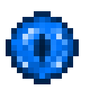

# Око наблюдателя

<figure><figcaption></figcaption></figure>

## Получение

#### _Крафт_

|                                                                                                                                   |  Око наблюдателя                                      |
| --------------------------------------------------------------------------------------------------------------------------------- | ----------------------------------------------------- |
| 
<a href="aquatic_dragon_scale.md">Совершенная чешуя дракона</a> + Око Эндера + <a href="acid.md">Кислотная капля</a>
 |  |

## Использование

#### _Как ингредиент при крафте_

#### [Драконий конденсатор](draconic_capacitor.md)

|                                                                                                                                                                                                                                                                                           |  Драконий конденсатор                              |
| ----------------------------------------------------------------------------------------------------------------------------------------------------------------------------------------------------------------------------------------------------------------------------------------- | -------------------------------------------------- |
| 
<a href="dragon_star.md">Драконья звезда</a> + <a href="dragon_heart.md">Сердце дракона</a> + <a href="call_of_the_watcher.md">Око наблюдателя</a> + <a href="dragon_elytra.md">Крылья дракона</a> + <a href="draconic_energy_core.md">Энергетическое ядро дракона</a>
 |  |

