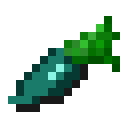

# Ендер морковь

<figure><figcaption></figcaption></figure>

## Получение

#### _Крафт_

|                            |  Ендер морковь                               |
| -------------------------- | -------------------------------------------- |
| 
Эндер-жемчугМорковь
 |  |

## Использование

#### _Как ингредиент при крафте_

#### [Морковь мечты](dream_carrot.md)

|                                                                                                                                                                                                                                                                                                                                                                                                      |  Морковь мечты                               |
| ---------------------------------------------------------------------------------------------------------------------------------------------------------------------------------------------------------------------------------------------------------------------------------------------------------------------------------------------------------------------------------------------------- | -------------------------------------------- |
| 
<a href="carrot_diamond.md">Алмазная морковь</a> + <a href="weak_arcana_potion.md">Зелье Арканы</a> + <a href="carrot_emerald.md">Изумрудная морковь</a> + Золотая морковь + <a href="ectoplasm.md">Эктоплазма</a> + <a href="carrot_redstone.md">Морковь редстоуна</a> + <a href="carrot_lapis.md">Лазуритная морковь</a> + <a href="carrot_ender.md">Ендер морковь</a>
 |  |

