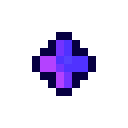

# Испорченная пуля

<figure><figcaption></figcaption></figure>

## Получение

#### _Крафт_

|                                                         |  Испорченная пуля                                |
| ------------------------------------------------------- | ------------------------------------------------ |
| 
Порох<a href="dark_crystal.md">Кристалл тьмы</a>
 |  |

## Использование

#### _Как ингредиент при крафте_

#### [Пространственное ядро](spawner_seeker.md)

|                                                                                                                                                               |  Пространственное ядро                         |
| ------------------------------------------------------------------------------------------------------------------------------------------------------------- | ---------------------------------------------- |
| 
<a href="corrupted_bullet.md">Испорченная пуля</a> + <a href="crocus_petals.md">Лепестки крокуса</a> + <a href="dusk_arc.md">Сумеречная дуга</a>
 |  |

