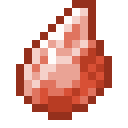

# Грубый камень огня

<figure><figcaption></figcaption></figure>

## Получение

#### _Крафт_

|                                                                                          |  Грубый камень огня                             |
| ---------------------------------------------------------------------------------------- | ----------------------------------------------- |
| 
Редстоуновая пыль<a href="red_aurum_ingot.md">Слиток Хана</a> + Огненный заряд
 |  |

## Использование

#### _Как ингредиент при крафте_

#### [Мощный камень огня](powerful_fire_shard.md)

|                                                                                                                                  |  Мощный камень огня                                  |
| -------------------------------------------------------------------------------------------------------------------------------- | ---------------------------------------------------- |
| 
<a href="crude_fire_gem.md">Грубый камень огня</a> + <a href="fairy_ingot.md">Волшебный слиток</a> + Огненный заряд
 |  |

