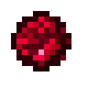

# Кусок Дарвена

<figure><figcaption></figcaption></figure>

## Получение

#### _Крафт_

|                                                                                                                         |  Кусок Дарвена                              |
| ----------------------------------------------------------------------------------------------------------------------- | ------------------------------------------- |
| 
Редстоуновая пыль<a href="weak_arcana_potion.md">Зелье Арканы</a> + <a href="fury_fire.md">Яростный огонь</a>
 |  |

## Использование

#### _Как ингредиент при крафте_

#### [Кусок Кароса](karos_lump.md)

|                                                                                                             |  Кусок Кароса                              |
| ----------------------------------------------------------------------------------------------------------- | ------------------------------------------ |
| 
<a href="darven_lump.md">Кусок Дарвена</a> + Алмаз + <a href="fury_fire.md">Яростный огонь</a>
 |  |

