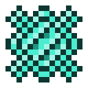

# Алмазная решетка

<figure><figcaption></figcaption></figure>

## Получение

#### _Крафт_

|                                               |  Алмазная решетка                               |
| --------------------------------------------- | ----------------------------------------------- |
| 
КременьАлмазный блокНезеритовый слиток
 |  |

## Использование

#### _Как ингредиент при крафте_

#### [Ядро рассеивания](diffusion_core.md)

|                                                                                                                     |  Ядро рассеивания                              |
| ------------------------------------------------------------------------------------------------------------------- | ---------------------------------------------- |
| 
<a href="logic_processor.md">Логический процессор</a> + <a href="diamond_lattice.md">Алмазная решетка</a>
 |  |

#### [Слиток кристаллической матрицы](crystal_matrix_ingot.md)

|                                                                                                                                                                                  |  Слиток кристаллической матрицы                       |
| -------------------------------------------------------------------------------------------------------------------------------------------------------------------------------- | ----------------------------------------------------- |
| 
<a href="refained_mana_crystal2.md">Очищенный кристалл маны</a> + <a href="flame_green.md">Пылающий сгусток</a> + <a href="diamond_lattice.md">Алмазная решетка</a>
 |  |

