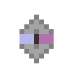

# Ядро рассеивания

<figure><figcaption></figcaption></figure>

## Получение

#### _Крафт_

|                                                                                                                     |  Ядро рассеивания                              |
| ------------------------------------------------------------------------------------------------------------------- | ---------------------------------------------- |
| 
<a href="logic_processor.md">Логический процессор</a> + <a href="diamond_lattice.md">Алмазная решетка</a>
 |  |

## Использование

#### _Как ингредиент при крафте_

#### [Эссенция тьмы](darkness.md)

|                                                                                                                                                                              |  Эссенция тьмы                          |
| ---------------------------------------------------------------------------------------------------------------------------------------------------------------------------- | --------------------------------------- |
| 
<a href="dark_nether_star.md">Темная звезда Нижнего мира</a> + <a href="flame_green.md">Пылающий сгусток</a> + <a href="diffusion_core.md">Ядро рассеивания</a>
 |  |

