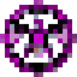

# Ячейка пространства

<figure><figcaption></figcaption></figure>

## Получение

#### _Крафт_

|                                                                                                        |  Ячейка пространства                                |
| ------------------------------------------------------------------------------------------------------ | --------------------------------------------------- |
| 
<a href="collector.md">Коллектор</a> + <a href="spawner_seeker.md">Пространственное ядро</a>
 |  |

## Использование

#### _Как ингредиент при крафте_

#### [Компонент пространственной ячейки 2 ур.](spatial_cell_component_16.md)

|                                                                                                                                                                                                                                                       |  Компонент пространственной ячейки 2 ур.                    |
| ----------------------------------------------------------------------------------------------------------------------------------------------------------------------------------------------------------------------------------------------------- | ----------------------------------------------------------- |
| 
<a href="fireite_ingot.md">Огненный слиток</a> + <a href="acid.md">Кислотная капля</a> + <a href="dislocator_advanced.md">Ячейка пространства</a> + <a href="spatial_cell_component_2.md">Компонент пространственной ячейки 1 ур.</a>
 |  |

#### [Компонент пространственной ячейки 3 ур.](spatial_cell_component_128.md)

|                                                                                                                                                                                                                                                        |  Компонент пространственной ячейки 3 ур.                     |
| ------------------------------------------------------------------------------------------------------------------------------------------------------------------------------------------------------------------------------------------------------ | ------------------------------------------------------------ |
| 
<a href="spatial_cell_component_16.md">Компонент пространственной ячейки 2 ур.</a> + <a href="acid.md">Кислотная капля</a> + <a href="dislocator_advanced.md">Ячейка пространства</a> + <a href="fireite_ingot.md">Огненный слиток</a>
 |  |

#### [Компонент чувств 2 ур.](cell_component_4k.md)

|                                                                                                                                                                                                                                         |  Компонент чувств 2 ур.                            |
| --------------------------------------------------------------------------------------------------------------------------------------------------------------------------------------------------------------------------------------- | -------------------------------------------------- |
| 
<a href="purple_blaze.md">Фиолетовое пламя</a> + <a href="cell_component_1k.md">Компонент чувств 1 ур.</a> + <a href="dislocator_advanced.md">Ячейка пространства</a> + <a href="enderite_ingot.md">Слиток эндерита</a>
 |  |

#### [Компонент чувств 3 ур.](cell_component_16k.md)

|                                                                                                                                                                                                                                         |  Компонент чувств 3 ур.                             |
| --------------------------------------------------------------------------------------------------------------------------------------------------------------------------------------------------------------------------------------- | --------------------------------------------------- |
| 
<a href="purple_blaze.md">Фиолетовое пламя</a> + <a href="cell_component_4k.md">Компонент чувств 2 ур.</a> + <a href="dislocator_advanced.md">Ячейка пространства</a> + <a href="enderite_ingot.md">Слиток эндерита</a>
 |  |

#### [Компонент чувств 4 ур.](cell_component_64k.md)

|                                                                                                                                                                                                                                          |  Компонент чувств 4 ур.                             |
| ---------------------------------------------------------------------------------------------------------------------------------------------------------------------------------------------------------------------------------------- | --------------------------------------------------- |
| 
<a href="purple_blaze.md">Фиолетовое пламя</a> + <a href="cell_component_16k.md">Компонент чувств 3 ур.</a> + <a href="dislocator_advanced.md">Ячейка пространства</a> + <a href="enderite_ingot.md">Слиток эндерита</a>
 |  |

#### [Компонент чувств 5 ур.](cell_component_256k.md)

|                                                                                                                                                                                                                                          |  Компонент чувств 5 ур.                              |
| ---------------------------------------------------------------------------------------------------------------------------------------------------------------------------------------------------------------------------------------- | ---------------------------------------------------- |
| 
<a href="purple_blaze.md">Фиолетовое пламя</a> + <a href="cell_component_64k.md">Компонент чувств 4 ур.</a> + <a href="dislocator_advanced.md">Ячейка пространства</a> + <a href="enderite_ingot.md">Слиток эндерита</a>
 |  |

