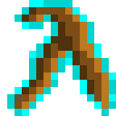

# Блестящая волшебная палочка

<figure><figcaption></figcaption></figure>

## Получение

#### _Крафт_

|                                                                                                                            |  Блестящая волшебная палочка                    |
| -------------------------------------------------------------------------------------------------------------------------- | ----------------------------------------------- |
| 
<a href="focus_2.md">Блестящий фокус</a> + 	Палка + <a href="divining_rod_1.md">Крепкая волшебная палочка</a>
 |  |

## Использование

#### _Как ингредиент при крафте_

#### [Великолепная волшебная палочка](divining_rod_3.md)

|                                                                                                                                 |  Великолепная волшебная палочка                 |
| ------------------------------------------------------------------------------------------------------------------------------- | ----------------------------------------------- |
| 
<a href="focus_3.md">Великолепный фокус</a> + 	Палка + <a href="divining_rod_2.md">Блестящая волшебная палочка</a>
 |  |

