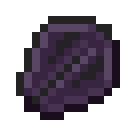

# Драконья чешуя

<figure><figcaption></figcaption></figure>

## Получение

#### _Крафт_

|                                                                                      |  Драконья чешуя                              |
| ------------------------------------------------------------------------------------ | -------------------------------------------- |
| 
Алмаз<a href="weak_arcana_potion.md">Зелье Арканы</a> + Незеритовый слиток
 |  |

## Использование

#### _Как ингредиент при крафте_

#### [Совершенная чешуя дракона](aquatic_dragon_scale.md)

|                                                                                                                                                             |  Совершенная чешуя дракона                            |
| ----------------------------------------------------------------------------------------------------------------------------------------------------------- | ----------------------------------------------------- |
| 
<a href="fireite_ingot.md">Огненный слиток</a> + <a href="dragon_scale.md">Драконья чешуя</a> + <a href="purple_blaze.md">Фиолетовое пламя</a>
 |  |

#### [Крылья дракона](dragon_elytra.md)

|                                                                                                                                                                                       |  Крылья дракона                               |
| ------------------------------------------------------------------------------------------------------------------------------------------------------------------------------------- | --------------------------------------------- |
| 
<a href="fairy_ingot.md">Волшебный слиток</a> + <a href="mechanical_elytra.md">Механические крылья</a> + <a href="aquatic_dragon_scale.md">Совершенная чешуя дракона</a>
 |  |

#### [Драконья звезда](dragon_star.md)

|                                                                                                  |  Драконья звезда                            |
| ------------------------------------------------------------------------------------------------ | ------------------------------------------- |
| 
Кристалл ЭндаЗвезда Незера<a href="aquatic_dragon_scale.md">Совершенная чешуя дракона</a>
 |  |

#### [Око наблюдателя](call_of_the_watcher.md)

|                                                                                                                                   |  Око наблюдателя                                      |
| --------------------------------------------------------------------------------------------------------------------------------- | ----------------------------------------------------- |
| 
<a href="aquatic_dragon_scale.md">Совершенная чешуя дракона</a> + Око Эндера + <a href="acid.md">Кислотная капля</a>
 |  |

