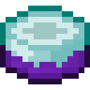

# Торт мечты

<figure><figcaption></figcaption></figure>

## Получение

#### _Крафт_

|                                                                                                                                                                                                                                      |  Торт мечты                                |
| ------------------------------------------------------------------------------------------------------------------------------------------------------------------------------------------------------------------------------------ | ------------------------------------------ |
| 
Ведро молока<a href="ectoplasm.md">Эктоплазма</a> + <a href="weak_arcana_potion.md">Зелье Арканы</a> + Торт + <a href="chocolate_cake.md">Шоколадный торт</a> + <a href="inventory_cake.md">Инвентарьный торт</a>
 |  |

## Использование

#### _Как ингредиент при крафте_

#### [Тьма](dark.md)

|                                                                                                                                                                                                                                                       |  Тьма                               |
| ----------------------------------------------------------------------------------------------------------------------------------------------------------------------------------------------------------------------------------------------------- | ----------------------------------- |
| 
<a href="dream_pie.md">Пирог мечты</a> + <a href="weak_arcana_potion.md">Зелье Арканы</a> + <a href="dream_carrot.md">Морковь мечты</a> + <a href="dream_cake.md">Торт мечты</a> + <a href="forbidden_fruit.md">Запретный плод</a>
 |  |

