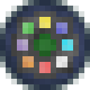

# Диск Эндера

<figure><figcaption></figcaption></figure>

## Получение

#### _Крафт_

|                                                                                                                                                    |  Диск Эндера                               |
| -------------------------------------------------------------------------------------------------------------------------------------------------- | ------------------------------------------ |
| 
<a href="ender_star.md">Звезда Эндера</a> + <a href="ender_core.md">Ядро Эндера</a> + <a href="enderite_ingot.md">Слиток эндерита</a>
 |  |

## Использование

#### _Как ингредиент при крафте_

#### [Творческий конденсатор](creative_capacitor.md)

|                                                                                                                                                                                                                                                                        |  Творческий конденсатор                            |
| ---------------------------------------------------------------------------------------------------------------------------------------------------------------------------------------------------------------------------------------------------------------------- | -------------------------------------------------- |
| 
<a href="enderite_ingot.md">Слиток эндерита</a> + <a href="settings_data.md">Данные настроек</a> + <a href="shape_data.md">Данные формы</a> + <a href="ender_disc.md">Диск Эндера</a> + <a href="legendary_ender_eye.md">Легендарное око эндера</a>
 |  |

