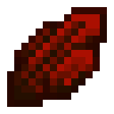

# Энергетический кристалл

<figure><figcaption></figcaption></figure>

## Получение

#### _Крафт_

|                                                            |  Энергетический кристалл                       |
| ---------------------------------------------------------- | ---------------------------------------------- |
| 
Светокаменная пыльРедстоуновый блокОсколок аметиста
 |  |

## Использование

#### _Как ингредиент при крафте_

#### [Термическая плита](thermoelectric_plate.md)

|                                                                                                                             |  Термическая плита                                   |
| --------------------------------------------------------------------------------------------------------------------------- | ---------------------------------------------------- |
| 
<a href="energy_crystal.md">Энергетический кристалл</a> + <a href="collector.md">Коллектор</a> + Медный слиток
 |  |

