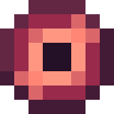

# Око восхождения

<figure><figcaption></figcaption></figure>

## Получение

#### _Крафт_

|                                                                                                                                                                                       |  Око восхождения                               |
| ------------------------------------------------------------------------------------------------------------------------------------------------------------------------------------- | ---------------------------------------------- |
| 
<a href="ascent_projectile.md">Шар восхождения</a> + <a href="ascentcore.md">Ядро восхождения</a> + <a href="crystal_matrix_ingot.md">Слиток кристаллической матрицы</a>
 |  |

## Использование

#### _Как ингредиент при крафте_

#### [Плоть демона](demon_flesh.md)

|                                                                                                                                                                                                                                                                             |  Плоть демона                               |
| --------------------------------------------------------------------------------------------------------------------------------------------------------------------------------------------------------------------------------------------------------------------------- | ------------------------------------------- |
| 
<a href="forbidden_fruit.md">Запретный плод</a> + <a href="acid.md">Кислотная капля</a> + <a href="blood_pearl_of_teleportation.md">Кровавая жемчужина</a> + <a href="sweet_heart.md">Сердце Лилит</a> + <a href="eye_projectile.md">Око восхождения</a>
 |  |

