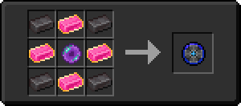

# Волшебный слиток

<figure><figcaption></figcaption></figure>

## Получение

#### _Крафт_

|                                                                                                                |  Волшебный слиток                           |
| -------------------------------------------------------------------------------------------------------------- | ------------------------------------------- |
| 
Незер-кварц<a href="weak_arcana_potion.md">Зелье Арканы</a> + <a href="dislocator.md">Дислокатор</a>
 |  |

## Использование

#### _Как ингредиент при крафте_

#### [Сердце Хана](red.md)

|                                                                                                                                                       |  Сердце Хана                       |
| ----------------------------------------------------------------------------------------------------------------------------------------------------- | ---------------------------------- |
| 
<a href="fairy_ingot.md">Волшебный слиток</a> + <a href="heart.md">Наполненное сердце</a> + <a href="red_aurum_ingot.md">Слиток Хана</a>
 |  |

#### [Компонент скрытности](stealthpotion.md)

|                                                                                                                                         |  Компонент скрытности                        |
| --------------------------------------------------------------------------------------------------------------------------------------- | -------------------------------------------- |
| 
<a href="fairy_ingot.md">Волшебный слиток</a> + <a href="spawner_seeker.md">Пространственное ядро</a> + Незеритовый слиток
 |  |

#### [Мощный камень воздуха](powerful_air_shard.md)

|                                                                                                                                    |  Мощный камень воздуха                              |
| ---------------------------------------------------------------------------------------------------------------------------------- | --------------------------------------------------- |
| 
<a href="crude_air_gem.md">Грубый камень воздуха</a> + <a href="fairy_ingot.md">Волшебный слиток</a> + Огненный заряд
 |  |

#### [Мощный камень земли](powerful_earth_shard.md)

|                                                                                                                                    |  Мощный камень земли                                  |
| ---------------------------------------------------------------------------------------------------------------------------------- | ----------------------------------------------------- |
| 
<a href="crude_earth_gem.md">Грубый камень земли</a> + <a href="fairy_ingot.md">Волшебный слиток</a> + Огненный заряд
 |  |

#### [Мощный камень огня](powerful_fire_shard.md)

|                                                                                                                                  |  Мощный камень огня                                  |
| -------------------------------------------------------------------------------------------------------------------------------- | ---------------------------------------------------- |
| 
<a href="crude_fire_gem.md">Грубый камень огня</a> + <a href="fairy_ingot.md">Волшебный слиток</a> + Огненный заряд
 |  |

#### [Мощный камень воды](powerful_water_shard.md)

|                                                                                                                                   |  Мощный камень воды                                   |
| --------------------------------------------------------------------------------------------------------------------------------- | ----------------------------------------------------- |
| 
<a href="crude_water_gem.md">Грубый камень воды</a> + <a href="fairy_ingot.md">Волшебный слиток</a> + Огненный заряд
 |  |

#### [Крылья дракона](dragon_elytra.md)

|                                                                                                                                                                                       |  Крылья дракона                               |
| ------------------------------------------------------------------------------------------------------------------------------------------------------------------------------------- | --------------------------------------------- |
| 
<a href="fairy_ingot.md">Волшебный слиток</a> + <a href="mechanical_elytra.md">Механические крылья</a> + <a href="aquatic_dragon_scale.md">Совершенная чешуя дракона</a>
 |  |

#### [Глаз циклопа](cyclops_eye.md)

|                                                                                                                 |  Глаз циклопа                               |
| --------------------------------------------------------------------------------------------------------------- | ------------------------------------------- |
| 
<a href="fairy_ingot.md">Волшебный слиток</a> + Око Эндера + <a href="acid.md">Кислотная капля</a>
 |  |

