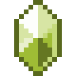

# Отличный камень воздуха

<figure><figcaption></figcaption></figure>

## Получение

#### _Крафт_

|                                                                                                                                          |  Отличный камень воздуха                      |
| ---------------------------------------------------------------------------------------------------------------------------------------- | --------------------------------------------- |
| 
<a href="powerful_air_shard.md">Мощный камень воздуха</a> + <a href="fireite_ingot.md">Огненный слиток</a> + Огненный заряд
 |  |

## Использование

#### _Как ингредиент при крафте_

#### [Чистый камень воздуха](pristine_air_gem.md)

|                                                                                                                         |  Чистый камень воздуха                            |
| ----------------------------------------------------------------------------------------------------------------------- | ------------------------------------------------- |
| 
<a href="fine_air_gem.md">Отличный камень воздуха</a> + <a href="spawner_seeker.md">Пространственное ядро</a>
 |  |

