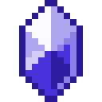

# Отличный камень воды

<figure><figcaption></figcaption></figure>

## Получение

#### _Крафт_

|                                                                                                                                         |  Отличный камень воды                           |
| --------------------------------------------------------------------------------------------------------------------------------------- | ----------------------------------------------- |
| 
<a href="powerful_water_shard.md">Мощный камень воды</a> + <a href="fireite_ingot.md">Огненный слиток</a> + Огненный заряд
 |  |

## Использование

#### _Как ингредиент при крафте_

#### [Чистый камень воды](pristine_water_gem.md)

|                                                                                                                        |  Чистый камень воды                                 |
| ---------------------------------------------------------------------------------------------------------------------- | --------------------------------------------------- |
| 
<a href="fine_water_gem.md">Отличный камень воды</a> + <a href="spawner_seeker.md">Пространственное ядро</a>
 |  |

