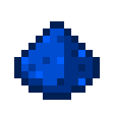

# Пыль синего алмаза

<figure><figcaption></figcaption></figure>

## Получение

#### _Крафт_

|                     |  Пыль синего алмаза                 |
| ------------------- | ----------------------------------- |
| 
ЛазуритАлмаз
 |  |

## Использование

#### _Как ингредиент при крафте_

#### [Кусок синего алмаза](blue_diamond_chunk.md)

|                                                                                                                                                      |  Кусок синего алмаза                                |
| ---------------------------------------------------------------------------------------------------------------------------------------------------- | --------------------------------------------------- |
| 
<a href="high.md">Пыль синего алмаза</a> + <a href="weak_arcana_potion.md">Зелье Арканы</a> + <a href="fury_fire.md">Яростный огонь</a>
 |  |

