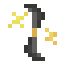

# Звезда Клейна 2 ур.

<figure><figcaption></figcaption></figure>

## Получение

#### _Крафт_

|                                                                                                                                                                    |  Звезда Клейна 2 ур.                          |
| ------------------------------------------------------------------------------------------------------------------------------------------------------------------ | --------------------------------------------- |
| 
<a href="klein_star_1.md">Звезда Клейна 1 ур.</a> + <a href="spawner_seeker.md">Пространственное ядро</a> + <a href="fury_fire.md">Яростный огонь</a>
 |  |

## Использование

#### _Как ингредиент при крафте_

#### [Звезда Клейна 3 ур.](klein_star_3.md)

|                                                                                                                                                                    |  Звезда Клейна 3 ур.                          |
| ------------------------------------------------------------------------------------------------------------------------------------------------------------------ | --------------------------------------------- |
| 
<a href="klein_star_2.md">Звезда Клейна 2 ур.</a> + <a href="spawner_seeker.md">Пространственное ядро</a> + <a href="fury_fire.md">Яростный огонь</a>
 |  |

