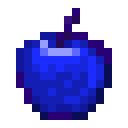
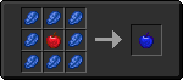

# Лазуритовое яблоко

<figure><figcaption></figcaption></figure>

## Получение

#### _Крафт_

|                       |  Лазуритовое яблоко                  |
| --------------------- | ------------------------------------ |
| 
Лазурит	Яблоко
 |  |

## Использование

#### _Как ингредиент при крафте_

#### [Лазуритовая плита](sapphire_plate_0.md)

|                         |  Лазуритовая плита                                |
| ----------------------- | ------------------------------------------------- |
| 
Лазуритовый блок
 |  |

#### [Аквамарин](aquamarine.md)

|                                                                                            |  Аквамарин                                |
| ------------------------------------------------------------------------------------------ | ----------------------------------------- |
| 
Лазурит<a href="aquatic_ingot.md">Водный слиток</a> + <a href="aqua.md">Аква</a>
 |  |

#### [Эфирная дуга](ethereal_arc.md)

|                                                                                                                                                                                                                                                                                                                                                                                                           |  Эфирная дуга                                |
| --------------------------------------------------------------------------------------------------------------------------------------------------------------------------------------------------------------------------------------------------------------------------------------------------------------------------------------------------------------------------------------------------------- | -------------------------------------------- |
| 
<a href="diamond.md">Алмазное яблоко</a> + <a href="_slowfall.md">Медное яблоко</a> + <a href="iron.md">Железное яблоко</a> + <a href="emerald.md">Изумрудное яблоко</a> + <a href="ectoplasm.md">Эктоплазма</a> + Золотое яблоко + <a href="lapis.md">Лазуритовое яблоко</a> + <a href="chocolate.md">Незеритовое яблоко</a> + <a href="chorus.md">Аметистовое яблоко</a>
 |  |

#### [Лазуритная морковь](carrot_lapis.md)

|                       |  Лазуритная морковь                          |
| --------------------- | -------------------------------------------- |
| 
ЛазуритМорковь
 |  |

#### [Морковь мечты](dream_carrot.md)

|                                                                                                                                                                                                                                                                                                                                                                                                      |  Морковь мечты                               |
| ---------------------------------------------------------------------------------------------------------------------------------------------------------------------------------------------------------------------------------------------------------------------------------------------------------------------------------------------------------------------------------------------------- | -------------------------------------------- |
| 
<a href="carrot_diamond.md">Алмазная морковь</a> + <a href="weak_arcana_potion.md">Зелье Арканы</a> + <a href="carrot_emerald.md">Изумрудная морковь</a> + Золотая морковь + <a href="ectoplasm.md">Эктоплазма</a> + <a href="carrot_redstone.md">Морковь редстоуна</a> + <a href="carrot_lapis.md">Лазуритная морковь</a> + <a href="carrot_ender.md">Ендер морковь</a>
 |  |

#### [Черничный пирог](blueberry_pie.md)

|                                       |  Черничный пирог                              |
| ------------------------------------- | --------------------------------------------- |
| 
СахарБутылочка мёдаЛазуритЯйцо
 |  |

#### [Кристалл маны](mana_crystal_item.md)

|                                     |  Кристалл маны                                     |
| ----------------------------------- | -------------------------------------------------- |
| 
ЛазуритОсколок аметистаСахар
 |  |

#### [Пыль синего алмаза](high.md)

|                     |  Пыль синего алмаза                 |
| ------------------- | ----------------------------------- |
| 
ЛазуритАлмаз
 |  |

#### [Грубый камень воды](crude_water_gem.md)

|                                                                                |  Грубый камень воды                              |
| ------------------------------------------------------------------------------ | ------------------------------------------------ |
| 
Лазурит<a href="red_aurum_ingot.md">Слиток Хана</a> + Огненный заряд
 |  |

