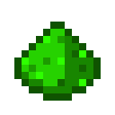
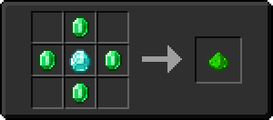

# Пыль зеленого алмаза

<figure><figcaption></figcaption></figure>

## Получение

#### _Крафт_

|                     |  Пыль зеленого алмаза              |
| ------------------- | ---------------------------------- |
| 
ИзумрудАлмаз
 |  |

## Использование

#### _Как ингредиент при крафте_

#### [Светокаменная плита](lumium_plate_0.md)

|                    |  Светокаменная плита                            |
| ------------------ | ----------------------------------------------- |
| 
Светокамень
 |  |

#### [Эфирная дуга](ethereal_arc.md)

|                                                                                                                                                                                                                                                                                                                                                                                                           |  Эфирная дуга                                |
| --------------------------------------------------------------------------------------------------------------------------------------------------------------------------------------------------------------------------------------------------------------------------------------------------------------------------------------------------------------------------------------------------------- | -------------------------------------------- |
| 
<a href="diamond.md">Алмазное яблоко</a> + <a href="_slowfall.md">Медное яблоко</a> + <a href="iron.md">Железное яблоко</a> + <a href="emerald.md">Изумрудное яблоко</a> + <a href="ectoplasm.md">Эктоплазма</a> + Золотое яблоко + <a href="lapis.md">Лазуритовое яблоко</a> + <a href="chocolate.md">Незеритовое яблоко</a> + <a href="chorus.md">Аметистовое яблоко</a>
 |  |

#### [Кусок коллектора](collector_fragments.md)

|                                                              |  Кусок коллектора                                   |
| ------------------------------------------------------------ | --------------------------------------------------- |
| 
Редстоуновая пыльНезеритовый слитокСветокаменная пыль
 |  |

#### [Энергетический кристалл](energy_crystal.md)

|                                                            |  Энергетический кристалл                       |
| ---------------------------------------------------------- | ---------------------------------------------- |
| 
Светокаменная пыльРедстоуновый блокОсколок аметиста
 |  |

#### [Ледяной камень](ice_stone.md)

|                                                                                                                       |  Ледяной камень                           |
| --------------------------------------------------------------------------------------------------------------------- | ----------------------------------------- |
| 
<a href="fireite_ingot.md">Огненный слиток</a> + <a href="yellow_diamond_chunk.md">Кусок желтого алмаза</a>
 |  |

#### [Кусок красного алмаза](red_diamond_chunk.md)

|                                                                                                                                                                     |  Кусок красного алмаза                             |
| ------------------------------------------------------------------------------------------------------------------------------------------------------------------- | -------------------------------------------------- |
| 
<a href="red_glowcane_dust.md">Пыль красного алмаза</a> + <a href="weak_arcana_potion.md">Зелье Арканы</a> + <a href="fury_fire.md">Яростный огонь</a>
 |  |

#### [Кусок зеленого алмаза](green_diamond_chunk.md)

|                                                                                                                                                       |  Кусок зеленого алмаза                               |
| ----------------------------------------------------------------------------------------------------------------------------------------------------- | ---------------------------------------------------- |
| 
<a href="low.md">Пыль зеленого алмаза</a> + <a href="weak_arcana_potion.md">Зелье Арканы</a> + <a href="fury_fire.md">Яростный огонь</a>
 |  |

