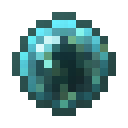

# Кровавый шар мага

<figure><figcaption></figcaption></figure>

## Получение

#### _Крафт_

|                                                                                                                                    |  Кровавый шар мага                              |
| ---------------------------------------------------------------------------------------------------------------------------------- | ----------------------------------------------- |
| 
<a href="apprenticebloodorb.md">Сфера крови ученика</a> + <a href="divining_rod_3.md">Великолепная волшебная палочка</a>
 |  |

## Использование

#### _Как ингредиент при крафте_

#### [Кровавый шар мастера](masterbloodorb.md)

|                                                                                                                                |  Кровавый шар мастера                         |
| ------------------------------------------------------------------------------------------------------------------------------ | --------------------------------------------- |
| 
<a href="magicianbloodorb.md">Кровавый шар мага</a> + <a href="divining_rod_3.md">Великолепная волшебная палочка</a>
 |  |

