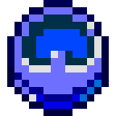

# Часы Луны

<figure><figcaption></figcaption></figure>

## Получение

#### _Крафт_

|                                                                                                                                |  Часы Луны                                 |
| ------------------------------------------------------------------------------------------------------------------------------ | ------------------------------------------ |
| 
<a href="perk_gem_night.md">Драгоценный камень ночи</a> + Часы + <a href="weak_arcana_potion.md">Зелье Арканы</a>
 |  |

## Использование

#### _Как ингредиент при крафте_

#### [Часы равноденствия](equinox_clock.md)

|                                                                                                                                                       |  Часы равноденствия                           |
| ----------------------------------------------------------------------------------------------------------------------------------------------------- | --------------------------------------------- |
| 
<a href="moon_clock.md">Часы Луны</a> + <a href="weak_arcana_potion.md">Зелье Арканы</a> + <a href="mysterious_clock.md">Часы Солнца</a>
 |  |

