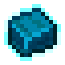

# Перезаряженный сплав

<figure><figcaption></figcaption></figure>

## Получение

#### _Крафт_

|                                                                                                                                                                                                                                                                                                                                                                                                                                                                                                      |  Перезаряженный сплав                             |
| ---------------------------------------------------------------------------------------------------------------------------------------------------------------------------------------------------------------------------------------------------------------------------------------------------------------------------------------------------------------------------------------------------------------------------------------------------------------------------------------------------- | ------------------------------------------------- |
| 
<a href="netherite_plate_0.md">Незеритовая плита</a> + <a href="lumium_plate_0.md">Светокаменная плита</a> + <a href="iron_plate_0.md">Железная плита</a> + <a href="copper_plate_0.md">Медная плита</a> + <a href="sapphire_plate_0.md">Лазуритовая плита</a> + <a href="ruby_plate_0.md">Редстоуновая плита</a> + <a href="gold_plate_0.md">Золотая плита</a> + <a href="diamond_plate_0.md">Алмазная плита</a> + <a href="emerald_plate_0.md">Изумрудная плита</a>
 |  |

## Использование

#### _Как ингредиент при крафте_

#### [Стержень метели](blizz_rod.md)

|                                                                                                                             |  Стержень метели                          |
| --------------------------------------------------------------------------------------------------------------------------- | ----------------------------------------- |
| 
Слеза гаста<a href="snowflake_shuriken.md">Снежинка</a> + <a href="overcharged_alloy.md">Перезаряженный сплав</a>
 |  |

