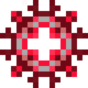

# Диск Пардимала

<figure><figcaption></figcaption></figure>

## Получение

#### _Крафт_

|                                                                                                               |  Диск Пардимала                               |
| ------------------------------------------------------------------------------------------------------------- | --------------------------------------------- |
| 
<a href="cermile_disk.md">Диск Цермила</a> + Изумруд + <a href="fury_fire.md">Яростный огонь</a>
 |  |

## Использование

#### _Как ингредиент при крафте_

#### [Диск Квадротика](quadrotic_disk.md)

|                                                                                                                  |  Диск Квадротика                               |
| ---------------------------------------------------------------------------------------------------------------- | ---------------------------------------------- |
| 
<a href="pardimal_disk.md">Диск Пардимала</a> + Изумруд + <a href="fury_fire.md">Яростный огонь</a>
 |  |

