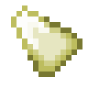

# Мощный камень воздуха

<figure><figcaption></figcaption></figure>

## Получение

#### _Крафт_

|                                                                                                                                    |  Мощный камень воздуха                              |
| ---------------------------------------------------------------------------------------------------------------------------------- | --------------------------------------------------- |
| 
<a href="crude_air_gem.md">Грубый камень воздуха</a> + <a href="fairy_ingot.md">Волшебный слиток</a> + Огненный заряд
 |  |

## Использование

#### _Как ингредиент при крафте_

#### [Отличный камень воздуха](fine_air_gem.md)

|                                                                                                                                          |  Отличный камень воздуха                      |
| ---------------------------------------------------------------------------------------------------------------------------------------- | --------------------------------------------- |
| 
<a href="powerful_air_shard.md">Мощный камень воздуха</a> + <a href="fireite_ingot.md">Огненный слиток</a> + Огненный заряд
 |  |

