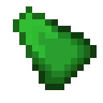

# Мощный камень земли

<figure><figcaption></figcaption></figure>

## Получение

#### _Крафт_

|                                                                                                                                    |  Мощный камень земли                                  |
| ---------------------------------------------------------------------------------------------------------------------------------- | ----------------------------------------------------- |
| 
<a href="crude_earth_gem.md">Грубый камень земли</a> + <a href="fairy_ingot.md">Волшебный слиток</a> + Огненный заряд
 |  |

## Использование

#### _Как ингредиент при крафте_

#### [Отличный камень земли](fine_earth_gem.md)

|                                                                                                                                          |  Отличный камень земли                          |
| ---------------------------------------------------------------------------------------------------------------------------------------- | ----------------------------------------------- |
| 
<a href="powerful_earth_shard.md">Мощный камень земли</a> + <a href="fireite_ingot.md">Огненный слиток</a> + Огненный заряд
 |  |

