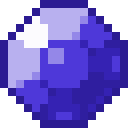

# Чистый камень воды

<figure><figcaption></figcaption></figure>

## Получение

#### _Крафт_

|                                                                                                                        |  Чистый камень воды                                 |
| ---------------------------------------------------------------------------------------------------------------------- | --------------------------------------------------- |
| 
<a href="fine_water_gem.md">Отличный камень воды</a> + <a href="spawner_seeker.md">Пространственное ядро</a>
 |  |

## Использование

#### _Как ингредиент при крафте_

#### [Элементальный держатель](pure_element_holder.md)

|                                                                                                                                                                                                                                                                                                                                                                                 |  Элементальный держатель                             |
| ------------------------------------------------------------------------------------------------------------------------------------------------------------------------------------------------------------------------------------------------------------------------------------------------------------------------------------------------------------------------------- | ---------------------------------------------------- |
| 
<a href="pristine_fire_gem.md">Чистый камень огня</a> + <a href="pristine_air_gem.md">Чистый камень воздуха</a> + <a href="pristine_water_gem.md">Чистый камень воды</a> + <a href="pristine_earth_gem.md">Чистый камень земли</a> + <a href="pure_element_holder_core.md">Пустой элементальный держатель</a> + <a href="fury_fire.md">Яростный огонь</a>
 |  |

