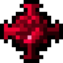

# Кусок Квадротика

<figure><figcaption></figcaption></figure>

## Получение

#### _Крафт_

|                                                                                                                 |  Кусок Квадротика                              |
| --------------------------------------------------------------------------------------------------------------- | ---------------------------------------------- |
| 
<a href="pardimal_lump.md">Кусок Пардимала</a> + Алмаз + <a href="fury_fire.md">Яростный огонь</a>
 |  |

## Использование

#### _Как ингредиент при крафте_

#### [Кусок Гелиоса](heliosis_lump.md)

|                                                                                                                   |  Кусок Гелиоса                                |
| ----------------------------------------------------------------------------------------------------------------- | --------------------------------------------- |
| 
<a href="quadrotic_lump.md">Кусок Квадротика</a> + Алмаз + <a href="fury_fire.md">Яростный огонь</a>
 |  |

