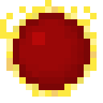
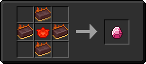

# Сердце Хана

<figure><figcaption></figcaption></figure>

## Получение

#### _Крафт_

|                                                                                                                                                       |  Сердце Хана                       |
| ----------------------------------------------------------------------------------------------------------------------------------------------------- | ---------------------------------- |
| 
<a href="fairy_ingot.md">Волшебный слиток</a> + <a href="heart.md">Наполненное сердце</a> + <a href="red_aurum_ingot.md">Слиток Хана</a>
 |  |

## Использование

#### _Как ингредиент при крафте_

#### [Редстоуновая плита](ruby_plate_0.md)

|                          |  Редстоуновая плита                           |
| ------------------------ | --------------------------------------------- |
| 
Редстоуновый блок
 |  |

#### [Морковь редстоуна](carrot_redstone.md)

|                                 |  Морковь редстоуна                              |
| ------------------------------- | ----------------------------------------------- |
| 
Редстоуновая пыльМорковь
 |  |

#### [Морковь мечты](dream_carrot.md)

|                                                                                                                                                                                                                                                                                                                                                                                                      |  Морковь мечты                               |
| ---------------------------------------------------------------------------------------------------------------------------------------------------------------------------------------------------------------------------------------------------------------------------------------------------------------------------------------------------------------------------------------------------- | -------------------------------------------- |
| 
<a href="carrot_diamond.md">Алмазная морковь</a> + <a href="weak_arcana_potion.md">Зелье Арканы</a> + <a href="carrot_emerald.md">Изумрудная морковь</a> + Золотая морковь + <a href="ectoplasm.md">Эктоплазма</a> + <a href="carrot_redstone.md">Морковь редстоуна</a> + <a href="carrot_lapis.md">Лазуритная морковь</a> + <a href="carrot_ender.md">Ендер морковь</a>
 |  |

#### [Малиновый пирог](crimson_berry_pie.md)

|                                                 |  Малиновый пирог                                   |
| ----------------------------------------------- | -------------------------------------------------- |
| 
СахарБутылочка мёдаРедстоуновая пыльЯйцо
 |  |

#### [Кусок коллектора](collector_fragments.md)

|                                                              |  Кусок коллектора                                   |
| ------------------------------------------------------------ | --------------------------------------------------- |
| 
Редстоуновая пыльНезеритовый слитокСветокаменная пыль
 |  |

#### [Энергетический кристалл](energy_crystal.md)

|                                                            |  Энергетический кристалл                       |
| ---------------------------------------------------------- | ---------------------------------------------- |
| 
Светокаменная пыльРедстоуновый блокОсколок аметиста
 |  |

#### [Камень мстительной разумной брони](sentientarmourgem_vengeful_deactivated.md)

|                                                                                                                                |  Камень мстительной разумной брони                                      |
| ------------------------------------------------------------------------------------------------------------------------------ | ----------------------------------------------------------------------- |
| 
<a href="logic_processor.md">Логический процессор</a> + Редстоуновая пыль + <a href="soulstone.md">Камень душ</a>
 |  |

#### [Хитчак](hitchak.md)

|                                                                                                                                 |  Хитчак                                |
| ------------------------------------------------------------------------------------------------------------------------------- | -------------------------------------- |
| 
Редстоуновая пыль<a href="fireite_ingot.md">Огненный слиток</a> + <a href="xp_crystal_4.md">Кристалл опыта 5  ур.</a>
 |  |

#### [Хранилище элемента 1 ур.](item_storage_cell_1k.md)

|                                                                                                                                                    |  Хранилище элемента 1 ур.                              |
| -------------------------------------------------------------------------------------------------------------------------------------------------- | ------------------------------------------------------ |
| 
Незеритовый слиток<a href="item_life.md">Сердце элемента</a> + Редстоуновая пыль + <a href="item_cell_housing.md">Корпус элемента</a>
 |  |

#### [Кровавый камень](bloodgem.md)

|                                                                                                                     |  Кровавый камень                        |
| ------------------------------------------------------------------------------------------------------------------- | --------------------------------------- |
| 
<a href="fireite_ingot.md">Огненный слиток</a> + <a href="red_diamond_chunk.md">Кусок красного алмаза</a>
 |  |

#### [Кусок красного алмаза](red_diamond_chunk.md)

|                                                                                                                                                                     |  Кусок красного алмаза                             |
| ------------------------------------------------------------------------------------------------------------------------------------------------------------------- | -------------------------------------------------- |
| 
<a href="red_glowcane_dust.md">Пыль красного алмаза</a> + <a href="weak_arcana_potion.md">Зелье Арканы</a> + <a href="fury_fire.md">Яростный огонь</a>
 |  |

#### [Пыль красного алмаза](red_glowcane_dust.md)

|                               |  Пыль красного алмаза                              |
| ----------------------------- | -------------------------------------------------- |
| 
Редстоуновая пыльАлмаз
 |  |

#### [Грубый камень воздуха](crude_air_gem.md)

|                                                                                       |  Грубый камень воздуха                         |
| ------------------------------------------------------------------------------------- | ---------------------------------------------- |
| 
Золотой слиток<a href="red_aurum_ingot.md">Слиток Хана</a> + Огненный заряд
 |  |

#### [Грубый камень земли](crude_earth_gem.md)

|                                                                                |  Грубый камень земли                             |
| ------------------------------------------------------------------------------ | ------------------------------------------------ |
| 
Изумруд<a href="red_aurum_ingot.md">Слиток Хана</a> + Огненный заряд
 |  |

#### [Грубый камень огня](crude_fire_gem.md)

|                                                                                          |  Грубый камень огня                             |
| ---------------------------------------------------------------------------------------- | ----------------------------------------------- |
| 
Редстоуновая пыль<a href="red_aurum_ingot.md">Слиток Хана</a> + Огненный заряд
 |  |

#### [Грубый камень огня](crude_fire_gem.md)

|                                                                                          |  Грубый камень огня                             |
| ---------------------------------------------------------------------------------------- | ----------------------------------------------- |
| 
Редстоуновая пыль<a href="red_aurum_ingot.md">Слиток Хана</a> + Огненный заряд
 |  |

#### [Грубый камень воды](crude_water_gem.md)

|                                                                                |  Грубый камень воды                              |
| ------------------------------------------------------------------------------ | ------------------------------------------------ |
| 
Лазурит<a href="red_aurum_ingot.md">Слиток Хана</a> + Огненный заряд
 |  |

#### [Сердце дракона](dragon_heart.md)

|                                                                                                                                                                   |  Сердце дракона                              |
| ----------------------------------------------------------------------------------------------------------------------------------------------------------------- | -------------------------------------------- |
| 
<a href="klein_star_6.md">Звезда Клейна 6 ур.</a> + <a href="red.md">Сердце Хана</a> + <a href="destruction_catalyst.md">Катализатор уничтожения</a>
 |  |

#### [Кусок Дарвена](darven_lump.md)

|                                                                                                                         |  Кусок Дарвена                              |
| ----------------------------------------------------------------------------------------------------------------------- | ------------------------------------------- |
| 
Редстоуновая пыль<a href="weak_arcana_potion.md">Зелье Арканы</a> + <a href="fury_fire.md">Яростный огонь</a>
 |  |

