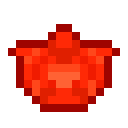

# Кусок красного алмаза

<figure><figcaption></figcaption></figure>

## Получение

#### _Крафт_

|                                                                                                                                                                     |  Кусок красного алмаза                             |
| ------------------------------------------------------------------------------------------------------------------------------------------------------------------- | -------------------------------------------------- |
| 
<a href="red_glowcane_dust.md">Пыль красного алмаза</a> + <a href="weak_arcana_potion.md">Зелье Арканы</a> + <a href="fury_fire.md">Яростный огонь</a>
 |  |

## Использование

#### _Как ингредиент при крафте_

#### [Кровавый камень](bloodgem.md)

|                                                                                                                     |  Кровавый камень                        |
| ------------------------------------------------------------------------------------------------------------------- | --------------------------------------- |
| 
<a href="fireite_ingot.md">Огненный слиток</a> + <a href="red_diamond_chunk.md">Кусок красного алмаза</a>
 |  |

