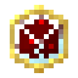

# Уменьшитель ритуального фокуса

<figure><figcaption></figcaption></figure>

## Получение

#### _Крафт_

|                                                                                                                                                                                    |  Уменьшитель ритуального фокуса                      |
| ---------------------------------------------------------------------------------------------------------------------------------------------------------------------------------- | ---------------------------------------------------- |
| 
<a href="perk_gem_day.md">Драгоценный камень дня</a> + <a href="ritual_focus_minor.md">Корпус ритуального инструмента</a> + <a href="fury_fire.md">Яростный огонь</a>
 |  |

## Использование

#### _Как ингредиент при крафте_

#### [Тотем равноденствия](totem_of_equinox.md)

|                                                                                                                                                                                     |  Тотем равноденствия                              |
| ----------------------------------------------------------------------------------------------------------------------------------------------------------------------------------- | ------------------------------------------------- |
| 
<a href="ritual_focus_greater.md">Усилитель ритульного фокуса</a> + Тотем бессмертия + Стекло + <a href="ritual_focus_lesser.md">Уменьшитель ритуального фокуса</a>
 |  |

