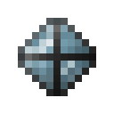

# Камень разумной брони

<figure><figcaption></figcaption></figure>

## Получение

#### _Крафт_

|                                                                                                                    |  Камень разумной брони                                        |
| ------------------------------------------------------------------------------------------------------------------ | ------------------------------------------------------------- |
| 
<a href="logic_processor.md">Логический процессор</a> + Алмаз + <a href="soulstone.md">Камень душ</a>
 |  |

## Использование

#### _Как ингредиент при крафте_

#### [Активированный камень разумной брони](sentientarmourgem_activated.md)

|                                                                                                                                 |  Активированный камень разумной брони                       |
| ------------------------------------------------------------------------------------------------------------------------------- | ----------------------------------------------------------- |
| 
<a href="purple_blaze.md">Фиолетовое пламя</a> + <a href="sentientarmourgem_deactivated.md">Камень разумной брони</a>
 |  |

