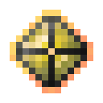

# Активированный камень разрушительной разумной брони

<figure><figcaption></figcaption></figure>

## Получение

#### _Крафт_

|                                                                                                                                                            |  Активированный камень разрушительной разумной брони                     |
| ---------------------------------------------------------------------------------------------------------------------------------------------------------- | ------------------------------------------------------------------------ |
| 
<a href="purple_blaze.md">Фиолетовое пламя</a> + <a href="sentientarmourgem_destructive_deactivated.md">Камень разрушительной разумной брони</a>
 |  |

## Использование

#### _Как ингредиент при крафте_

#### [Разрушительная душа монстра](basemonstersoul_destructive.md)

|                                                                                                                                                                                                                                                                               |  Разрушительная душа монстра                                |
| ----------------------------------------------------------------------------------------------------------------------------------------------------------------------------------------------------------------------------------------------------------------------------- | ----------------------------------------------------------- |
| 
<a href="purple_blaze.md">Фиолетовое пламя</a> + <a href="runic_arc.md">Руническая дуга</a> + <a href="sentientarmourgem_destructive_activated.md">Активированный камень разрушительной разумной брони</a> + <a href="weak_arcana_potion.md">Зелье Арканы</a>
 |  |

