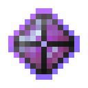

# Активированный камень стойкой разумной брони

<figure><figcaption></figcaption></figure>

## Получение

#### _Крафт_

|                                                                                                                                                   |  Активированный камень стойкой разумной брони                          |
| ------------------------------------------------------------------------------------------------------------------------------------------------- | ---------------------------------------------------------------------- |
| 
<a href="purple_blaze.md">Фиолетовое пламя</a> + <a href="sentientarmourgem_steadfast_deactivated.md">Камень стойкой разумной брони</a>
 |  |

## Использование

#### _Как ингредиент при крафте_

#### [Стойкая душа монстра](basemonstersoul_steadfast.md)

|                                                                                                                                                                                                                                                                 |  Стойкая душа монстра                                     |
| --------------------------------------------------------------------------------------------------------------------------------------------------------------------------------------------------------------------------------------------------------------- | --------------------------------------------------------- |
| 
<a href="purple_blaze.md">Фиолетовое пламя</a> + <a href="astrolabe.md">Астролябия</a> + <a href="sentientarmourgem_steadfast_activated.md">Активированный камень стойкой разумной брони</a> + <a href="weak_arcana_potion.md">Зелье Арканы</a>
 |  |

