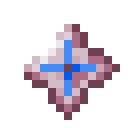
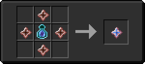

# Камень душ

<figure><figcaption></figcaption></figure>

## Получение

#### _Крафт_

|                                                                                                                               |  Камень душ                              |
| ----------------------------------------------------------------------------------------------------------------------------- | ---------------------------------------- |
| 
<a href="blood_infusion_core.md">Сердечник для инфузии крови</a> + <a href="weak_arcana_potion.md">Зелье Арканы</a>
 |  |

## Использование

#### _Как ингредиент при крафте_

#### [Камень разумной брони](sentientarmourgem_deactivated.md)

|                                                                                                                    |  Камень разумной брони                                        |
| ------------------------------------------------------------------------------------------------------------------ | ------------------------------------------------------------- |
| 
<a href="logic_processor.md">Логический процессор</a> + Алмаз + <a href="soulstone.md">Камень душ</a>
 |  |

#### [Камень коррозийной разумной брони](sentientarmourgem_corrosive_deactivated.md)

|                                                                                                                      |  Камень коррозийной разумной брони                                       |
| -------------------------------------------------------------------------------------------------------------------- | ------------------------------------------------------------------------ |
| 
<a href="logic_processor.md">Логический процессор</a> + Изумруд + <a href="soulstone.md">Камень душ</a>
 |  |

#### [Камень мстительной разумной брони](sentientarmourgem_vengeful_deactivated.md)

|                                                                                                                                |  Камень мстительной разумной брони                                      |
| ------------------------------------------------------------------------------------------------------------------------------ | ----------------------------------------------------------------------- |
| 
<a href="logic_processor.md">Логический процессор</a> + Редстоуновая пыль + <a href="soulstone.md">Камень душ</a>
 |  |

#### [Камень разрушительной разумной брони](sentientarmourgem_destructive_deactivated.md)

|                                                                                                                             |  Камень разрушительной разумной брони                                      |
| --------------------------------------------------------------------------------------------------------------------------- | -------------------------------------------------------------------------- |
| 
<a href="logic_processor.md">Логический процессор</a> + Золотой слиток + <a href="soulstone.md">Камень душ</a>
 |  |

#### [Камень стойкой разумной брони](sentientarmourgem_steadfast_deactivated.md)

|                                                                                                                               |  Камень стойкой разумной брони                                           |
| ----------------------------------------------------------------------------------------------------------------------------- | ------------------------------------------------------------------------ |
| 
<a href="logic_processor.md">Логический процессор</a> + Осколок аметиста + <a href="soulstone.md">Камень душ</a>
 |  |

