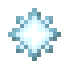

# Звездная вспышка

<figure><figcaption></figcaption></figure>

## Получение

#### _Крафт_

|                                               |  Звездная вспышка                          |
| --------------------------------------------- | ------------------------------------------ |
| 
Осколок эхаОгненный зарядЗвезда Незера
 |  |

## Использование

#### _Как ингредиент при крафте_

#### [Зелье Арканы](weak_arcana_potion.md)

|                                                                                                                                                                                   |  Зелье Арканы                                       |
| --------------------------------------------------------------------------------------------------------------------------------------------------------------------------------- | --------------------------------------------------- |
| 
Пузырёк опыта<a href="blizz_rod.md">Стержень метели</a> + <a href="star_flare.md">Звездная вспышка</a> + Драконье дыхание + <a href="aquamarine.md">Аквамарин</a>
 |  |

#### [Снежинка](snowflake_shuriken.md)

|                                                                      |  Снежинка                                          |
| -------------------------------------------------------------------- | -------------------------------------------------- |
| 
	Блок снегаСнежок<a href="star_flare.md">Звездная вспышка</a>
 |  |

